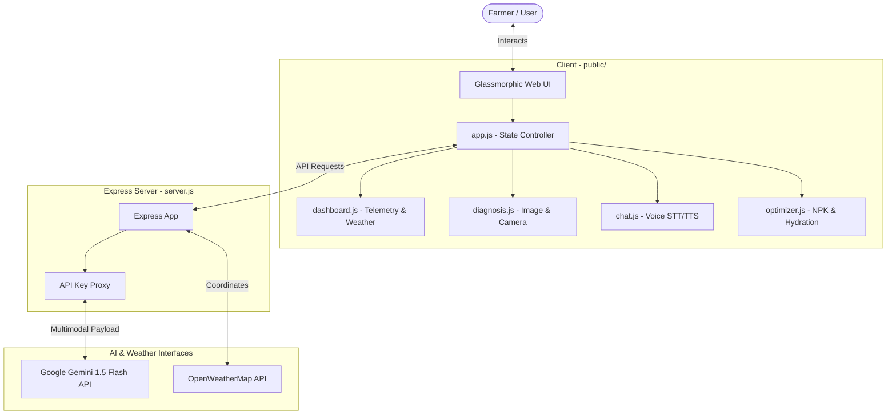
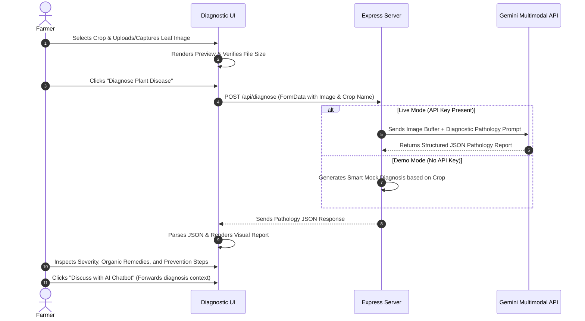
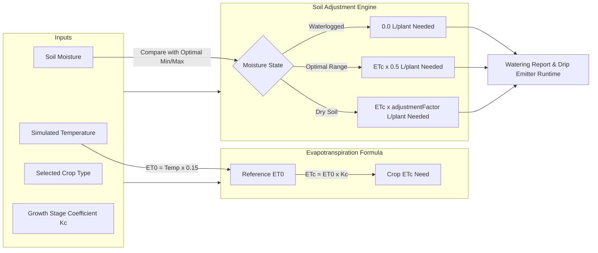

# AgriShield AI: Multimodal Crop Advisory & Disease Diagnosis Agent

AgriShield AI is an autonomous, multimodal AI agricultural agent designed to empower farmers with real-time, localized agronomic insights. By combining local environmental telemetry simulation, computer vision pathology diagnosis, regional language voice interactions, and evapotranspiration-based irrigation calculations, AgriShield AI offers an all-in-one smart farming copilot.

---

## 🌟 Key Features

*   **🔬 Multimodal Disease Diagnostic Lab**: Farmers can upload crop leaf images or use their device's camera. The system applies computer vision via Gemini's multimodal engine to diagnose plant diseases, assess severity, and outline organic remedies and chemical treatments.
*   **🌡️ Real-Time Telemetry Simulator**: Allows testing and simulation of temperature, humidity, soil moisture, and sunlight levels. The application dynamically evaluates crop conditions and updates an overall **Crop Health Index**.
*   **🎙️ Multilingual Voice Chat Advisor**: Enables speech-to-text (STT) voice input and text-to-speech (TTS) voice synthesis. Farmers can speak directly to the AI in **English, Hindi, Telugu, Tamil, Marathi, Bengali, or Kannada** (explicitly excluding Spanish).
*   **💧 Irrigation & Soil Optimizer**: Calculates irrigation volumes (in liters/plant) and drip runtime using crop-stage coefficients ($K_c$) and real-time moisture telemetry. Provides diagnostic N-P-K nutrient stabilization tips based on soil inputs.
*   **📦 Smart Demo Mode**: Fully functional out of the box with intelligent fallback mockup pathologics and translations. You can activate the live Gemini 1.5 engine instantly through the UI or configuration variables.

---

## 📐 System Architecture & Workflows

### 1. General System Architecture



---

### 2. Crop Disease Diagnosis Workflow



---

### 3. Smart Irrigation Optimizer Workflow



---

## 🛠️ Installation & Setup

### Requirements
*   **Node.js** (v18.0.0 or higher recommended)
*   **npm** (bundled with Node.js)
*   An active internet connection (to connect to the Gemini API)

### 1. Clone the repository and navigate to the directory:
```bash
git clone https://github.com/sujeetkrsuman/agrishieldai.git
cd agrishieldai
```

### 2. Install dependencies:
```bash
npm install
```

### 3. Configure API Credentials:
Create a `.env` file in the root of the project (template included):
```env
PORT=3000
GEMINI_API_KEY=your_gemini_api_key_here
OPENWEATHER_API_KEY=your_openweathermap_key_here
```
> [!NOTE]
> If `GEMINI_API_KEY` is left blank, the application will automatically start in **Smart Demo Mode**. You can also input and modify your Gemini API key directly through the **Settings** tab in the running Web UI.

### 4. Start the server:
```bash
npm start
```
The server will bind to `http://localhost:3000`. Open your browser and navigate to the link.

---

## 📡 API Reference

### 1. Health Status
Checks whether the server is online and verifies whether it is using the live Gemini model or mock data.

*   **URL**: `/api/health`
*   **Method**: `GET`
*   **Headers**: Optional `Authorization: Bearer <API_KEY>`
*   **Success Response (200 OK)**:
    ```json
    {
      "status": "healthy",
      "demoMode": false,
      "hasEnvKey": true,
      "message": "API connected to Live Gemini Engine."
    }
    ```

---

### 2. Crop Disease Diagnosis
Uploads a crop leaf image for pathology diagnosis.

*   **URL**: `/api/diagnose`
*   **Method**: `POST`
*   **Headers**: 
    *   `Content-Type: multipart/form-data`
    *   Optional `Authorization: Bearer <API_KEY>`
*   **Request Body**:
    *   `image`: File (Leaf Image Binary)
    *   `crop`: String (e.g. `tomato`)
*   **Success Response (200 OK)**:
    ```json
    {
      "crop": "Tomato",
      "disease": "Tomato Late Blight",
      "scientificName": "Phytophthora infestans",
      "confidence": 0.94,
      "severity": "High",
      "description": "Late blight is a destructive fungal-like disease caused by an oomycete pathogen. It spreads rapidly in cool, wet weather...",
      "remedies": {
        "organic": [
          "Prune and destroy infected leaves and stems immediately. Do not compost them.",
          "Apply copper-based fungicides or baking soda solutions to protect healthy foliage."
        ],
        "chemical": [
          "Apply preventive fungicides containing Chlorothalonil or Mancozeb."
        ]
      },
      "prevention": [
        "Avoid overhead watering; use drip irrigation to keep foliage dry.",
        "Rotate crops annually."
      ]
    }
    ```

---

### 3. Advisor Chat
Asks the agricultural agent a question with environmental context.

*   **URL**: `/api/chat`
*   **Method**: `POST`
*   **Headers**:
    *   `Content-Type: application/json`
    *   Optional `Authorization: Bearer <API_KEY>`
*   **Request Body**:
    ```json
    {
      "message": "How do I balance nitrogen in my tomato soil?",
      "history": [],
      "language": "hi",
      "context": {
        "crop": "tomato",
        "temperature": 26,
        "moisture": 50,
        "humidity": 65,
        "sunExposure": "moderate"
      }
    }
    ```
*   **Success Response (200 OK)**:
    ```json
    {
      "response": "टमाटर के मिट्टी में नाइट्रोजन को संतुलित करने के लिए, आप कार्बनिक पदार्थों जैसे खाद या सड़ी हुई खाद का उपयोग कर सकते हैं..."
    }
    ```

---

## 🎙️ Voice & Browser Support Guidelines

*   **Speech Recognition (Speech-to-Text)**: Standard browser support for Web Speech API varies. **Google Chrome** provides the highest accuracy and out-of-the-box support for regional languages (Hindi, Telugu, Tamil, Marathi, Bengali, Kannada).
*   **Speech Synthesis (Text-to-Speech)**: The voices read out loud rely on the speech synthesis engine installed on your operating system and browser. Chrome or Edge are recommended for natural-sounding language voices.
*   **Device Permissions**: You must allow **Microphone** and **Camera** access permissions in your browser settings to run voice input and live leaf diagnostic snapshots.

---

## 📄 License
This project is open-source and available under the MIT License.
